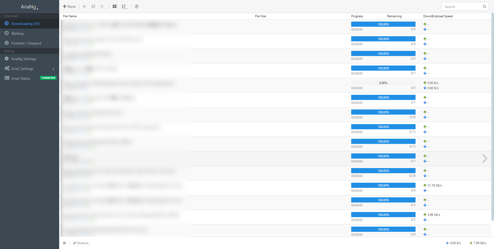

# AriaNg

for original [readme file](./README.md)

The author refused to add upload speed to AriaNg but allowed the distribution of branches, which is exactly what this responsitory has done.

## screenshots

#### desktop

